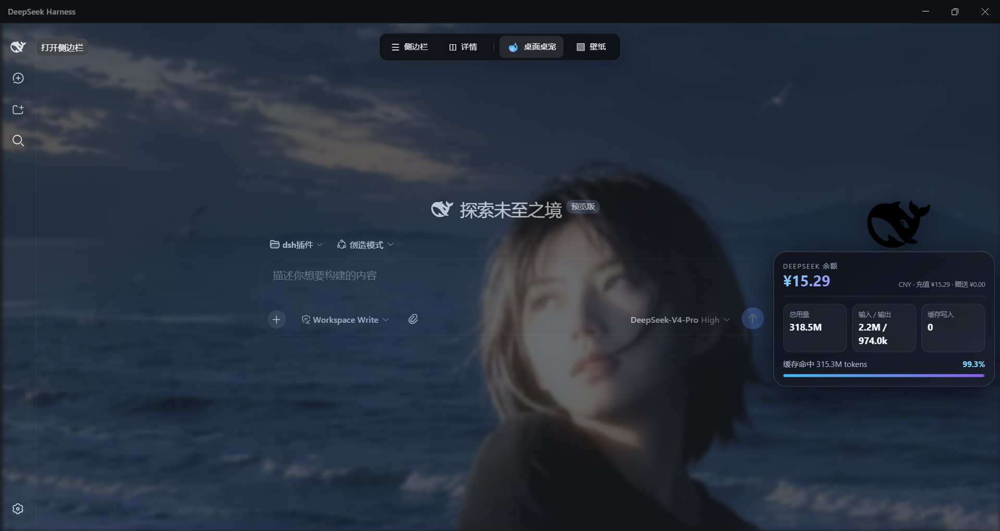

# DeepSeek Harness Desktop 增强套件



这是一套为 [DeepSeek Harness](https://www.deepseek.com)（本地安装的 DSH，回环端口 `3080`）构建的自用增强插件 + 原生桌面应用，把 DSH 变成一个更像「桌面软件」的工作环境。

仓库只保留**最终版本**的源码，已清除所有个人路径、密钥、对话记录与账户余额信息。

> 本项目为个人学习 / 自用项目，与 DeepSeek 官方无关。
>
> **兼容性**：适配 DeepSeek Harness 0.1.0-rc.6；壁纸功能需要 `sharp` 图像库（未安装时其余功能不受影响）。

---

## 目录结构

```
├── plugins/                 # 6 个 Cordis 插件
│   ├── desktop-experience/  # 壁纸、黑鲸鱼桌宠、贴边 dock、设置页与透明度滑块
│   ├── dsh-token-pet/       # DeepSeek 余额 + 会话 token 用量数据源
│   ├── dsh-office-docs/     # Office 文档安全读取（docx / pptx / xlsx）
│   ├── personal-assistant/  # 本地秘书 + 文档生成工具
│   ├── safe-auto-approval/  # 工具调用的安全自动批准策略
│   └── dsh-desktop-app/     # 桌面应用入口 / PWA / 应用图标
├── desktop/                 # Electron 原生桌面应用（frameless、贴边隐藏、独立桌宠窗口、托盘）
├── tools/                   # Restart-DshService.ps1（脱机重启后端）
├── LICENSE                  # MIT
└── .gitignore
```

---

## 功能介绍

### 1. 桌面体验（desktop-experience，v0.1.23）

- **本地壁纸**：支持 PNG / JPEG / WebP / GIF。图片经过安全扫描与转码（动态图转成 animated WebP，静态图同时生成封面），拒绝 SVG、网页、远程 URL 和视频。
- **壁纸美化**：可调「模糊」「玻璃质感」「壁纸透明度」。
- **对话框 / 工作区不透明度**：分别控制底部输入框（对话框）与左侧栏（工作区）的透明度。底色跟随系统主题（浅色主题为白色，深色主题为深灰），**0 = 完全透明、100 = 完全不透明**，中间值实时过渡。
- **顶栏快捷栏（dock）**：鼠标移到屏幕顶部自动显示、移开自动隐藏；提供侧边栏开关、详情开关、桌宠开关、壁纸开关。
- **黑鲸鱼桌宠**：独立透明置顶窗口，可离开 DSH 在 Windows 桌面自由拖动；点击查看 DeepSeek 余额、token 用量与缓存命中率；右键菜单可刷新 / 复位 / 关闭。
- **设置页**：在 DSH 设置里注入「桌面体验」「桌宠」「壁纸」三个标签页。

### 2. 余额与用量数据源（dsh-token-pet，v0.1.1）

- 读取 DeepSeek 官方 `user/balance` 接口，展示账户余额。
- 统计当前会话的 token 用量（输入 / 输出 / 缓存读 / 缓存写 / 命中率），按「最近活跃会话」选择当前会话。
- 提供 `GET /dsh-token-pet/data.json` 给桌宠或其他面板使用。

### 3. Office 文档读取（dsh-office-docs，v0.1.0）

- 安全读取 Word / PowerPoint / Excel：路径越界防护、文件类型与内容格式校验、只读解析。

### 4. 个人助理（personal-assistant，v0.1.1）

- **本地秘书**：任务清单、便签、每日摘要、会议纪要（只写入本地工作区）。
- **文档生成**：`assistant_document_create_text/docx/pptx/xlsx` 一键生成文档。
- 图片收件箱、本机状态读取等辅助能力。

### 5. 安全自动批准（safe-auto-approval，v0.1.1）

- 对只读类工具调用自动放行，涉及写操作的工具调用仍要求用户确认，减少打断。

### 6. 桌面应用入口（dsh-desktop-app，v0.1.0）

- 原生应用定位、PWA 支持、应用图标生成脚本。

### 7. 原生桌面应用（desktop/）

- 无边框现代窗口（自带标题栏与最小化 / 最大化 / 关闭）。
- 主窗口贴边自动隐藏（失去焦点后缩到屏幕边缘，鼠标靠近边缘唤回）。
- 独立黑鲸鱼桌宠窗口（透明、置顶、点击穿透、全桌面拖动）。
- 系统托盘（显示 / 隐藏、开机自启、自动隐藏开关、重新加载、退出）、单实例锁、窗口状态记忆。

---

## 安装说明

### 一键安装（推荐小白使用）

在 PowerShell 中，进入本仓库根目录后运行：

```powershell
powershell -ExecutionPolicy Bypass -File install.ps1
```

脚本会自动完成：检查环境（Node.js / pnpm / git）→ 定位或安装 DeepSeek Harness → 安装 6 个增强插件 → 构建桌面应用 → 重启后端并验证。

常用参数：

```powershell
.\install.ps1 -HarnessRoot "D:\path\to\deepseek-harness"   # 手动指定 DSH 根目录
.\install.ps1 -Port 3090                                    # 换端口（默认 3080，端口被占用时用）
.\install.ps1 -SkipDesktopApp                               # 跳过桌面应用构建
.\install.ps1 -SkipRestart                                  # 安装后不自动重启后端
```

### 环境要求

- Windows 10 / 11
- 已安装 DeepSeek Harness（本仓库假设其根目录为 `D:\path\to\deepseek-harness`）
- Node.js ≥ 24（DSH 自带 runtime 亦可）
- pnpm

### 安装插件（所有插件同一条安全门禁）

以 `desktop-experience` 为例：

```powershell
# 1. 打包（拒绝任何生命周期脚本）
pnpm pack

# 2. 安全扫描（Defender + 静态模式分析 + 依赖审计，产出不可变报告）
powershell -NoProfile -ExecutionPolicy Bypass -File D:\path\to\deepseek-harness\security\Inspect-PluginPackage.ps1 -Package <生成的.tgz>

# 3. 复核报告后安装
powershell -NoProfile -ExecutionPolicy Bypass -File D:\path\to\deepseek-harness\security\Install-PluginSafely.ps1 -Package <同一个.tgz> -ApprovedReport <报告.json> -Approve

# 4. 脱机重启后端
powershell -NoProfile -ExecutionPolicy Bypass -File D:\path\to\dsh-plugins\tools\Restart-DshService.ps1
```

各插件目录下的 `build\` 内也提供了对应的打包脚本（如 `Build-DshTokenPetPlugin.ps1`、`Build-DshOfficeDocsPlugin.ps1`），直接运行即可完成「打包 + 扫描」两步。

### 构建桌面应用（desktop/）

```powershell
powershell -NoProfile -ExecutionPolicy Bypass -File D:\path\to\dsh-plugins\desktop\build\Build-DshDesktopApp.ps1
```

构建产物为 `desktop\dist\DeepSeekHarness\DeepSeekHarness.exe`，并会在桌面创建快捷方式。

---

## 操作步骤

1. **启动**：双击桌面快捷方式（或运行 `DeepSeekHarness.exe`），应用会自动检查并启动本地 DSH 后端，就绪后进入主界面。
2. **打开设置**：点击 DSH 界面里的设置入口，打开设置面板。
3. **更换壁纸**：设置 → **壁纸** → 点击「从本地导入壁纸」选择图片，或把图片放入收件箱后点「安全扫描并更换」；用滑块调整「模糊 / 玻璃质感 / 透明度」。
4. **调整对话框 / 工作区不透明度**：设置 → **壁纸** → 拖动「对话框不透明度」「工作区不透明度」滑块（0 = 完全透明，100 = 完全不透明，底色跟随系统主题）。
5. **桌宠**：
   - 打开：顶部 dock 点 🐋（按一下打开、再按一下关闭），或 设置 → **桌宠** → 「立即打开」。
   - 拖动：按住鲸鱼拖动到桌面任意位置。
   - 查看数据：点击鲸鱼，气泡显示余额、token 用量与缓存命中率。
   - 关闭：右键鲸鱼 → 「关闭桌宠」。
6. **顶部快捷栏**：鼠标移到屏幕顶部唤起 dock；「☰」切换侧边栏、「◫」切换详情栏、「▧」开关壁纸。
7. **托盘**：右键托盘鲸鱼图标可显示 / 隐藏主窗口、开机自启、自动隐藏窗口、重新加载、退出。

---

## 社区与生态

本项目属于 DeepSeek Harness（DSH）社区生态的一部分，可关注以下资源发现更多插件、也让本项目被更多人看到：

- [awesome-deepseek-harness](https://github.com/Dominic789654/awesome-deepseek-harness) —— DSH 生态精选列表（插件 / 技能 / MCP / UI / 工作流）
- [awesome-dsh-plugin](https://github.com/beancookie/awesome-dsh-plugin) —— DSH 插件精选列表
- [dsh-plugin-marketplace](https://github.com/YELEBAI/dsh-plugin-marketplace) —— 社区插件市场
- [WhaleHub 🐋](https://github.com/vvlife/whalehub-dsh) —— DSH 插件市场（发现、搜索、一键安装）
- 搜索话题：`dsh` · `dsh-plugin` · `deepseek-harness`

---

## 隐私说明

- 本仓库**不含**任何对话记录、账户余额、真实 API 密钥或机器特定的绝对路径。
- 源码中的绝对路径一律用 `D:\path\to\deepseek-harness` 与 `D:\path\to\dsh-plugins` 占位。
- 测试文件中的 `sk-test`、`sk-abc123`、`sk-quoted` 等均为**假数据**。

---

## 版权与商标

- 代码与文档：**MIT**（见 `LICENSE`）。
- `dsh-black-whale.ico`、`dsh-app-icon-*.png` 等鲸鱼 logo 为 **DeepSeek 的商标 / 品牌资产**，**不在** MIT 授权范围内，仅用于项目内展示；请勿擅自用于商业用途或衍生品牌。

---

## 授权与使用声明

- 你可以**自由地**基于本项目：
  - 制作视频教程、图文教程、演示与评测；
  - 进行二次开发、修改、学习、fork 与再分发（遵守 MIT）。
- 但请遵守以下约定：
  1. **注明来处**：在使用或衍生作品中保留本项目名称与出处（如本仓库链接 / 作者信息）。
  2. **鲸鱼 logo 除外**：DeepSeek 鲸鱼品牌资产不受本项目 MIT 授权，请勿用于商业用途或衍生品牌。
  3. 本项目与 DeepSeek 官方无关，请勿以官方名义发布。

感谢使用与传播！
